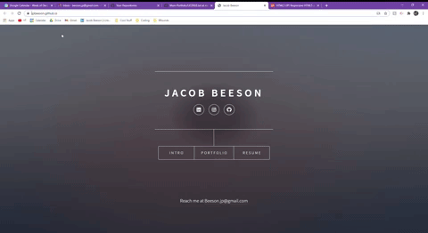

# Main Portfolio
  My main portfolio website that I will be updating often to include most recent projects, up-to-date resume information, and sending to potential employers.
   
  https://boxnbeeson.github.io/Portfolio/

  ## Table of Contents
  * [Demo](#demo)
  * [Developer's Information](#devInfo)
  * [Credentials](#credentials)
  * [License](#license)
  
  ## Demo
  

  ## Developer's Information
  Feel free to contact me using the information below if you have any questions or feedback!
   
  Name: Jacob Beeson
   
  [Github](https://github.com/boxnbeeson)
   
  Email: <boxnbeeson@gmail.com>

  ## Credentials
  Template downloaded and used under the CCA license from https://html5up.net/
  ## License
  Creative Commons Attribution 3.0 Unported
   
  http://creativecommons.org/licenses/by/3.0/
